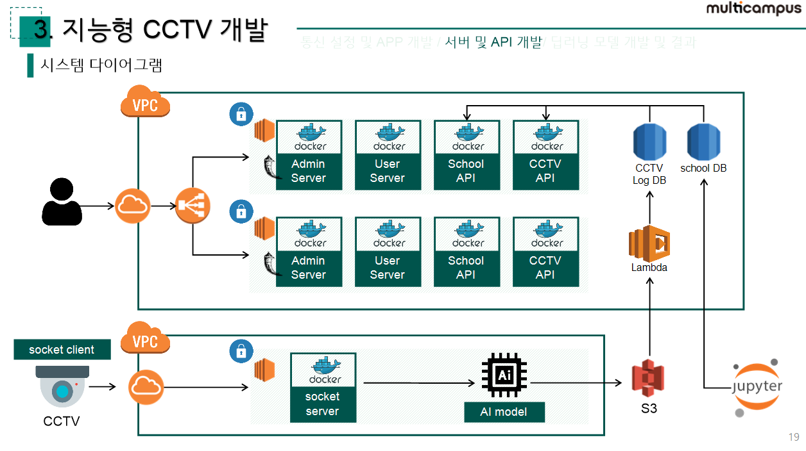
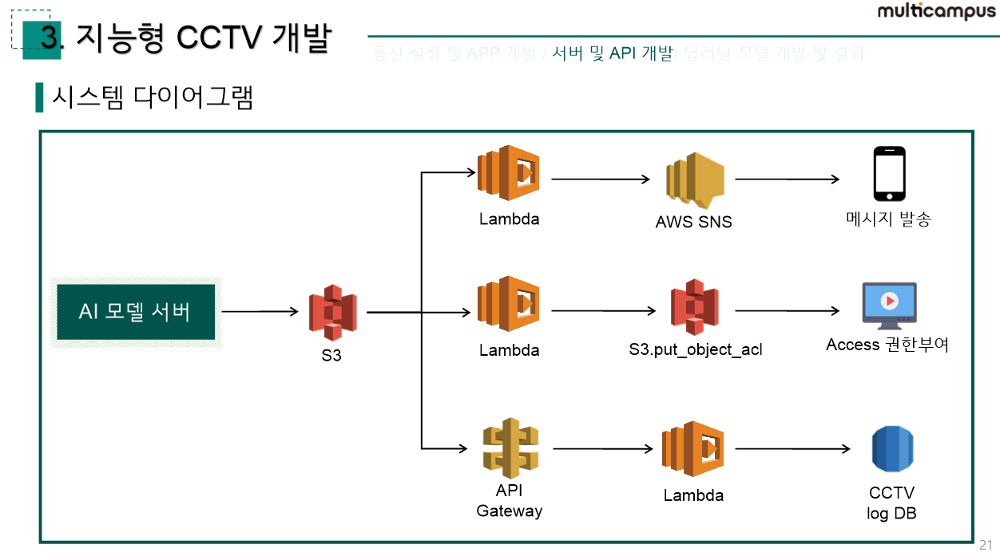
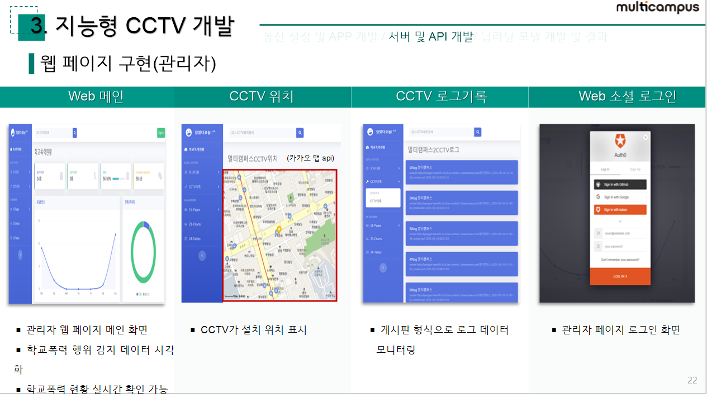
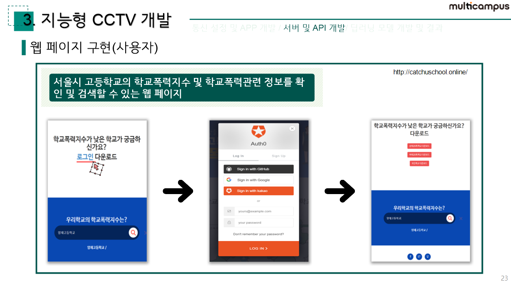

# 학교 폭력 리포트 시스템

1. CCTV에서 AI모델로 영상 전달을 위해 소켓통신서버를 구성했고 추후에 모델의 분석 결과에 따라 영상이 S3에 저장됩니다.

2. S3에 저장되고나면 트리거로 람다가 동작하여 CCTV log DB로 ai 모델의 결과값이 로그로 저장됩니다.

3. chool DB는 빅데이터에서 분석한 결과가 담긴 csv파일을 직접 넣어주었습니다.

4. log 정보와 학교폭력관련 정보는 CCTV API서버와 School API서버에서 restful api로 제공합니다.

5. 제공된 api는 admin서버와 user서버에서 사용하고 그 값을 웹페이지를 통해서 확인할 수 있습니다.

6. 다른 서브넷에 서버를 하나 더 생성하여 오류발생시 갑작스럽게 서비스가 종료되는것을 방지했습니다. 또한 로드벨런서를 이용해서 유저페이지에 사용자가 접속할때 부하를 분산할 수 있도록 하였습니다.

- AI모델이 분석을 진행하면 그 결과 값에 따라 s3에 영상이 저장되는데 이때 트리거를 통해 람다가 동작하면서 ‘메시지발송’, ‘영상 access권한 부여’, ‘로그 저장’이 진행됩니다.

- 람다로 결과값을 처리하고나면 관리자 페이지를 통해서 학교폭력 현황을 그래프 형태로 실시간 확인 가능합니다.

- 게시판 형식으로 로그 데이터를 모니터링 할 수 있습니다. 이때 게시된 로그를 클릭하면 s3에 저장된 영상을 확인할 수 있습니다.

- 관리자페이지와는 별개로 사용자용 페이지를 제작했습니다. 
- 본 페이지에서는 서울시 내 모든 고등학교의 학교폭력지수 결과 파일을 다운받을 수 있습니다.
- 학교명 검색을 통해 해당 학교에서 발생한 폭력 발생 건수, 심의횟수 등 관련 이슈 현황을 확인 할 수 있습니다.

